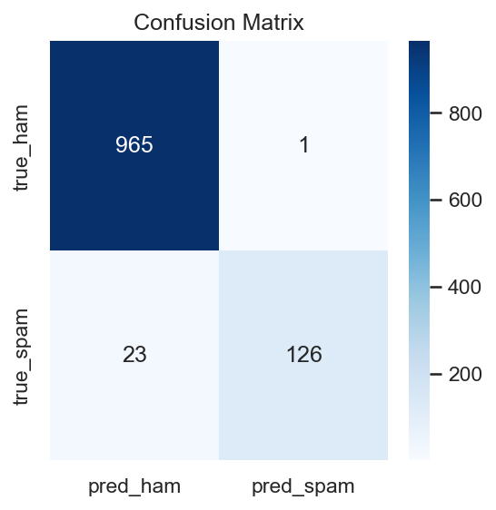
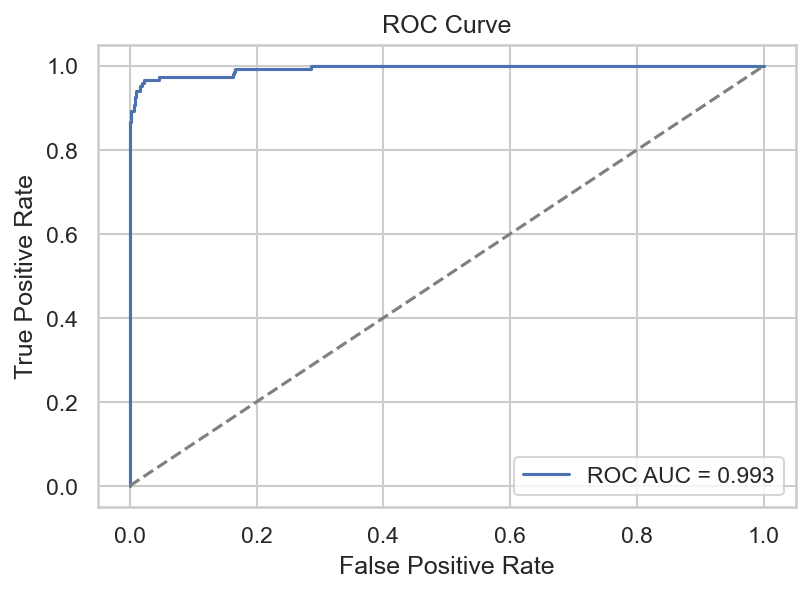
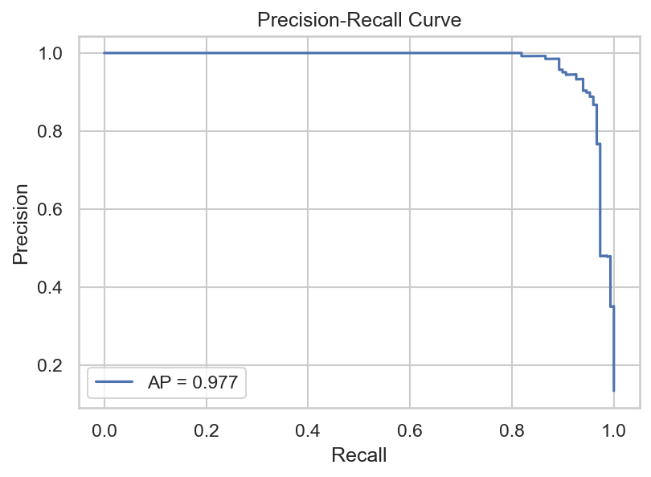
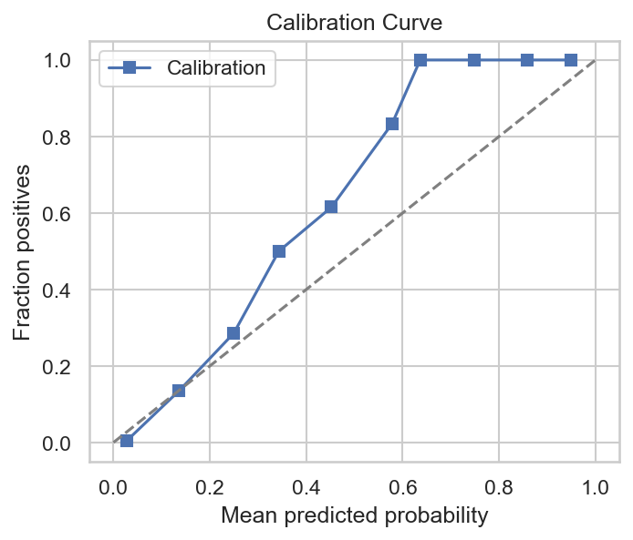
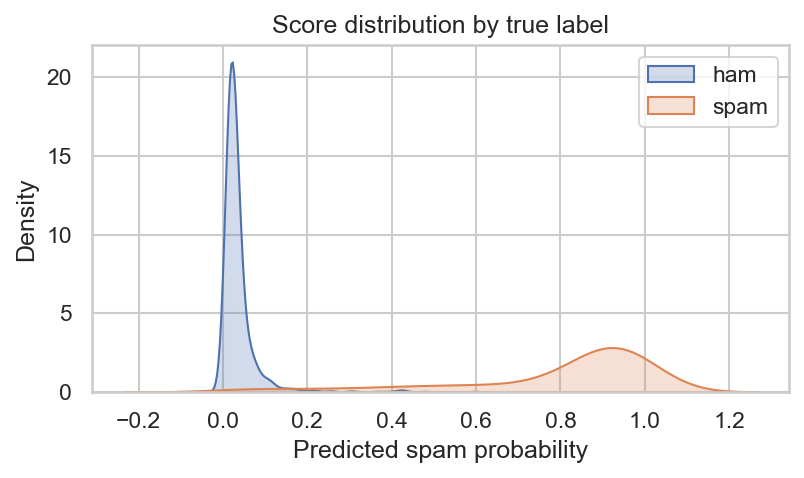
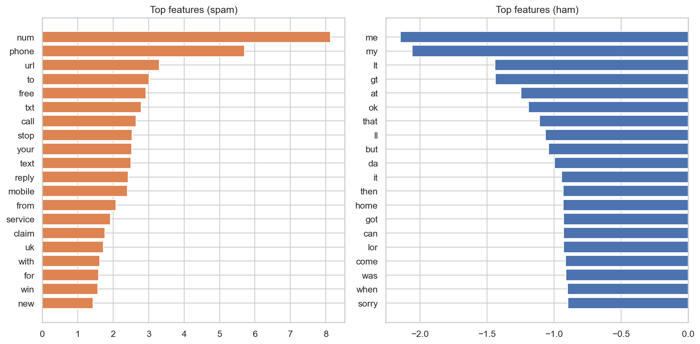
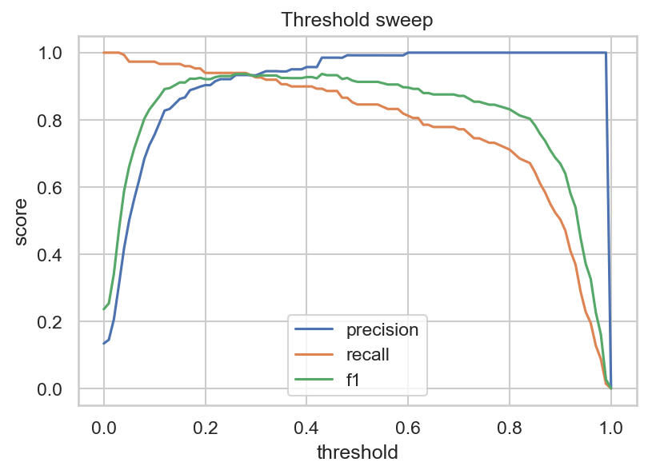

# HW3 作業報告 — 簡訊垃圾分類 (TF-IDF + Logistic Regression)

此文件為本次作業的完整報告，包含需求摘要、資料、前處理、模型設計、實驗結果、視覺化圖表、使用說明與可重現步驟。所有範例程式與筆記本均放在本專案中，請以相對路徑（例如 `datasets/processed/sms_spam_clean.csv`、`models/logreg_pipeline.joblib`）存取，不會在輸出中顯示使用者或系統的絕對路徑以保護隱私。

## Streamlit Demo：連結與執行結果（佔位）

此處保留位置以放置已部署的 Streamlit 應用連結與執行結果圖（方便在 README 直接展示）。請在部署完成後將以下佔位文字替換為實際的 URL 或把產生的圖檔放到 `reports/visualizations/` 下，README 會自動顯示它們。

- Streamlit App：

	[Streamlit Demo - 點此開啟](https://aiothomework3-affkudwlftpskjmgn4rw7q.streamlit.app/)

- 若要以 badge 顯示（選用）：

	[]

執行結果圖（範例佔位）：在你本機或 CI 執行 notebook 的 export cell 後，將會產生並儲存在 `reports/visualizations/`，你可以把下面的佔位圖直接替換為實際圖檔：


替換說明：

- 將 `<STREAMLIT_APP_URL>` 替換為你的部署 URL（例如 Streamlit Cloud、Heroku 或自架的網址）。
- 若想在 README 顯示本機生成的圖，請確保圖檔已儲存到 `reports/visualizations/`，並以相對路徑引用（如上）。
- 若圖檔不存在，Markdown 會顯示破圖；你也可先上傳小尺寸預覽圖再替換為高解析圖。

## 1. 目標

建立一個能夠辨識簡訊是否為垃圾訊息（spam）的二元分類系統。要求：
- 使用文字特徵（TF-IDF）與簡潔可訓練的線性模型（Logistic Regression）。
- 提供可重現的前處理步驟、訓練程式、評估報告與視覺化，並包含互動式 Streamlit demo。

## 2. 資料

- 優先使用：`datasets/processed/sms_spam_clean.csv`（已清洗、相對路徑）。
- fallback：`sms_spam_no_header.csv`（Packt 原始格式，兩欄，無 header）。
- 標籤欄位通常命名為 `label`，文字欄位可能為 `text`, `message`, `message_clean` 等；Notebook 有自動偵測機制以避免 KeyError。

資料分割：使用 stratified train/test split（test_size=0.2, random_state=42）以維持類別分佈。

## 3. 前處理

主要內容與設計原則：
- Normalize & mask：把 URL、Email、電話號碼替換為 `<URL>`, `<EMAIL>`, `<PHONE>`；數字視情況替換為 `<NUM>`。這樣可以減少稀疏性並保留結構性訊息。
- 小寫化、去除多餘標點及多餘空白。
- 先做最少侵入式處理（保留短語、簡訊特有符號），以保留分類線索。

實作位置：`src/spam_pipeline/preprocess.py`，並在 notebook 與 app 中重複使用以確保一致性（train / predict 使用相同前處理）。

## 4. 特徵與模型

- 特徵：TF-IDF 向量化（`sklearn.feature_extraction.text.TfidfVectorizer`），限制 `max_features`（例如 20k）以控制記憶體。預設不使用額外停用詞過濾以保留簡訊術語。
- 模型：`sklearn.linear_model.LogisticRegression`（max_iter 提高到 1000 以收斂），放入 `sklearn.pipeline.Pipeline` 中方便序列化（joblib）。

訓練流程實作：`src/spam_pipeline/train.py` 或 notebook 中的訓練 cell（可選擇 grid search 以微調 C）。訓練後儲存 pipeline 到 `models/logreg_pipeline.joblib`。

## 5. 評估指標

主要指標：accuracy、precision、recall、F1、ROC AUC、Average Precision（AP）。
另外展示：confusion matrix、Precision-Recall curve、Calibration curve、Brier score、score distribution 與 threshold sweep（precision/recall/f1 隨閾值變化）。

範例實驗結果（Notebook 範例執行）
- Confusion matrix: [[965, 1], [23, 126]] （以 `ham` 為 negative、`spam` 為 positive）
- Classification report（test）: ham: prec~0.98 r~1.00 f1~0.99；spam: prec~0.99 r~0.85 f1~0.91；accuracy~0.98
- ROC AUC ≈ 0.993；AP ≈ 0.977

（注意：上述為範例執行結果，實際以本機執行為準）

## 6. 視覺化與可視化輸出

Notebook 與 app 已產生多張視覺化圖表，包含：
- Confusion matrix
- ROC curve
- Precision-Recall curve
- Calibration curve
- Score distribution by true label
- Top TF-IDF features for spam/ham
- Threshold sweep plot

預設會將這些圖存放於 `reports/visualizations/`，建議檔名：
- `confusion_matrix.png`
- `roc_curve.png`
- `precision_recall.png`
- `calibration.png`
- `score_distribution.png`
- `top_tfidf_features.png`
- `threshold_sweep.png`

在本 repo 的 `README.md` 末段已放置了嵌入這些圖的 Markdown 標記；在本機產生圖檔後可直接在 README 中呈現。

## 7. 互動式介面（Streamlit）

- 檔案：`app.py`（提供上傳 CSV、單筆預測、閾值調整、混淆矩陣與 ROC/PR 視覺化、下載 metrics 功能）。
- 部署說明：在本機或 Streamlit Cloud 上部署即可。若缺少可選套件（例如 seaborn、wordcloud），app 已提供 fallback，但建議依 `requirements.txt` 安裝完整套件。

啟動（PowerShell）：
```powershell
python -m venv .venv
.\.venv\Scripts\Activate.ps1
pip install -r requirements.txt
streamlit run app.py
```


## 8. 可重現性與測試

- 已提供 `requirements.txt`（包含 pandas, scikit-learn, streamlit 等），建議在乾淨虛擬環境中安裝以重現結果。
- 單元測試：`tests/` 包含針對 ingest 與 preprocess 的 pytest 測試，可用 `pytest -q` 執行。

## 9. 檔案列表（重要）

- `hw3_spam_classification.ipynb` — 完整筆記本（EDA、train、eval、export）
- `app.py` — Streamlit 互動介面
- `src/spam_pipeline/` — 模組化程式碼（ingest, preprocess, train, predict）
- `scripts/` — CLI 腳本的 wrapper（train, predict, visualize）
- `models/logreg_pipeline.joblib` — 訓練後之 pipeline（如存在）
- `reports/visualizations/` — 儲存輸出的圖檔（若執行匯出 cell）

## 10. 清理與備份

- 開發期間會產生暫存檔（`__pycache__`, `.pyc`, `.ipynb_checkpoints` 等），這些檔案可安全刪除以節省空間。本 repo 提供 workspace cleanup 建議（請在刪除前確認不再需要模型或原始資料）。

## 11. 未來改進與延伸方向

- 增加更強的文字前處理（拼字校正、簡繁體正規化、更多遮蔽策略）。
- 嘗試更複雜的模型（如 linear SVM、LightGBM 或簡單的 Transformer-based classifier）並比較效能。 
- 加入解釋性工具（SHAP/LIME），提供單筆預測的 token 貢獻度。 
- 自動化報表（一鍵匯出 PDF/HTML 報告）與 CI 驗證（執行 pytest、檢查 notebook 執行成功）。

## 12. 聯絡與授權

若需協助把新的功能加入（例如 FP/FN 檢視、圖表匯出、Top-k feature table、單筆 token-level contributions），或要我在此環境幫你執行 notebook 並產生 `reports/visualizations/` 圖檔，請回覆具體要求，我會接著執行。

---

作者：專案程式助理（由使用者的專案程式碼與 notebook 生成）
日期：請以 repository 內的 commit 時間為準

## Results & Figures

本專案的 `hw3_spam_classification.ipynb` 已執行範例訓練與評估，下面為一組在測試集上（範例執行）得到的摘要結果；實際數值會依資料切分與隨機種子而不同，請以你本機實際執行結果為準。

- Confusion matrix (test set):
	- True ham → Pred ham: 965
	- True ham → Pred spam: 1
	- True spam → Pred ham: 23
	- True spam → Pred spam: 126

- Classification report (test set, example run):
	- ham: precision ≈ 0.98, recall ≈ 1.00, f1 ≈ 0.99 (support 966)
	- spam: precision ≈ 0.99, recall ≈ 0.85, f1 ≈ 0.91 (support 149)
	- accuracy ≈ 0.98

- Area under ROC (AUC): ≈ 0.993
- Average Precision (AP): ≈ 0.977

這些指標是 notebook 範例執行時所產生的典型結果；若要在你的環境重現並把圖嵌入到 README，可按以下步驟操作。

生成與儲存圖檔（建議檔名與位置）：

1. 在 `hw3_spam_classification.ipynb` 中執行評估 cell（ROC / PR / 混淆矩陣 / calibration / score distribution / top-features）。
2. 在每張圖顯示後執行以下儲存程式碼（範例）：

```python
import os
os.makedirs('reports/visualizations', exist_ok=True)
fig.savefig(f"reports/visualizations/roc_{os.path.basename(DATA_PATH)}.png", bbox_inches='tight', dpi=150)
```

建議的圖檔命名（Notebook 預期）：

- `reports/visualizations/confusion_matrix.png`
- `reports/visualizations/roc_curve.png`
- `reports/visualizations/precision_recall.png`
- `reports/visualizations/calibration.png`
- `reports/visualizations/score_distribution.png`
- `reports/visualizations/top_tfidf_features.png`

已產生的範例圖（請在本機執行 Notebook 的匯出 cell 或使用 scripts/visualize_spam.py 來重建）：









如何把圖嵌入 README

在 `README.md` 中（或其他 Markdown 文件）使用標準 Markdown 語法插入圖檔：

```markdown


```

自動化（script）

你可以在 `scripts/visualize_spam.py` 中加入一段簡單腳本來自動化：載入模型與資料、計算評估指標，並把各圖存到 `reports/visualizations/`。如果需要，我可以幫你實作這個 script。

註記

- 若你要我現在代為執行 notebook 的新增 EDA / 分析 cells，或產生並存檔這些圖檔，請回覆「執行 notebook cells 並儲存圖檔」，並告訴我要執行的 cell 範圍（例如「從第 5 到第 11 cell」或「全部 cells」）。


